# 創世紀 V:命運勇士 — 繁體中文重製

> *Ultima V: Warriors of Destiny*(1988)—— Go + Ebitengine 重寫的跨平台引擎,加上完整繁體中文化。

**現況:主線跑得完,文字也翻完了。** 開場動畫、世界地圖、三十二個地點的場景、對話、
八種商店、戰鬥、魔法、地牢第一人稱透視、音樂,以及八座聖壇 → 寶典 → 力量之言 →
暗影君主 → 黑棘審問這一整條主線都跑得起來。

中文化方面:**NPC 對白 1,712 / 1,713 段(99.9%)**、商店對白 194 段、五個明文檔 114 筆、
觀察敘述 216 段、招牌與墓碑、譯名 304 筆、介面字串全數完成。而且不只是「表裡有譯文」——
走 `交談 → 關鍵字 → 訊息欄` 這條**實際遊戲路徑**掃過 135 段對話開場與 1,307 個關鍵字回應,
**零行英文**([`talkzh_test.go`](internal/game/talkzh_test.go))。唯一沒翻的一段原文
就是四個字母的殘片 `caug`,刻意保留。

⚠ **還沒有的是外部驗證**:「機制與原版一模一樣」目前只有靜態讀碼支撐 ——
對 DOSBox 原版並排實測還沒跑過(見下方「還沒到的地方」)。
逐項進度見 [`WORKLIST.md`](WORKLIST.md)。

---

## 畫面

以下都是引擎跑出來的實際畫面(640×400,倚天點陣中文)。

| | |
|---|---|
| 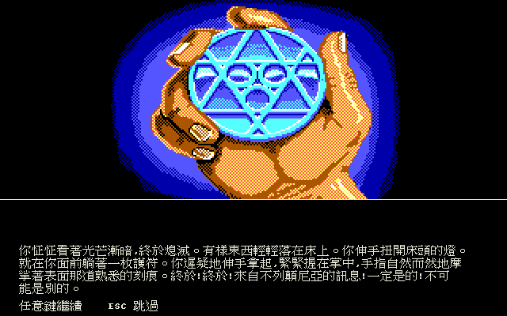 | 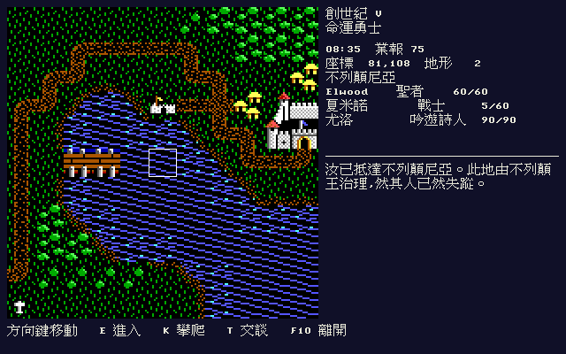 |
| **開場動畫** —— 21 頁,插圖與文字的配對照原版的頁表;敘事全繁中 | **不列顛尼亞** —— 64×64 的地圖分塊拼成 256×256 的世界,右欄是時間、業報、隊伍狀態 |
| 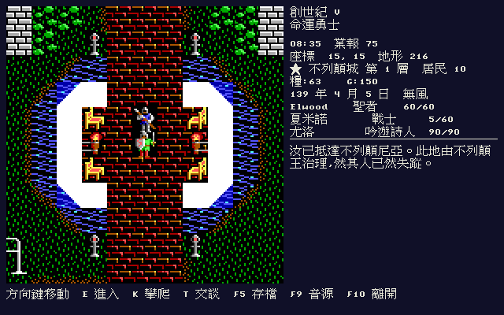 | 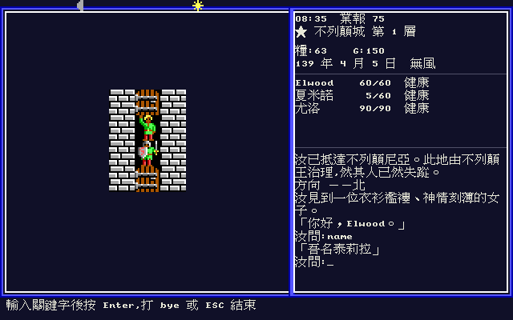 |
| **不列顛城** —— 三十二個地點各有 32×32 的場景地圖與依時刻表走動的 NPC | **交談** —— 原版的關鍵字對話(`name` / `job` / `join`),NPC 名字已中文化 |
| 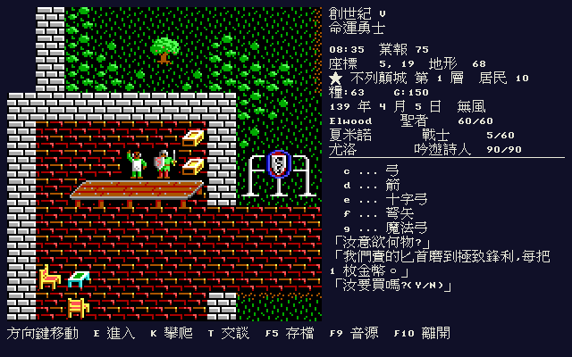 | 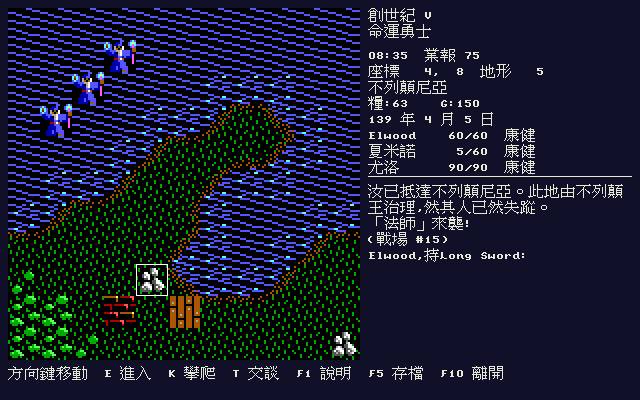 |
| **武具店** —— 八種商店的完整交易流程,價格與庫存照原版的表;**194 段店家對白全數中譯**,價格與品名由原版的佔位符帶進來 | **戰鬥** —— 11×11 戰場、敏捷決定的出手順序、原版的命中與傷害公式 |
| 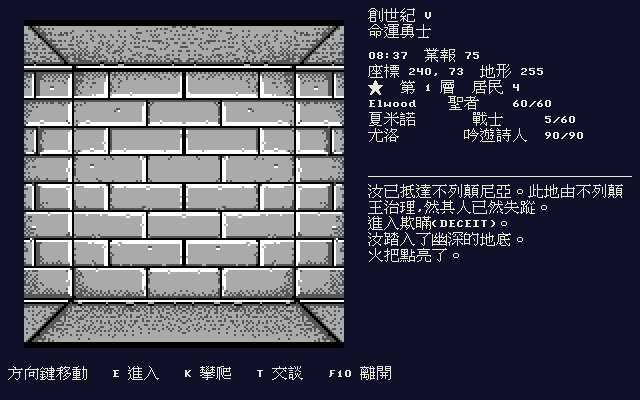 | 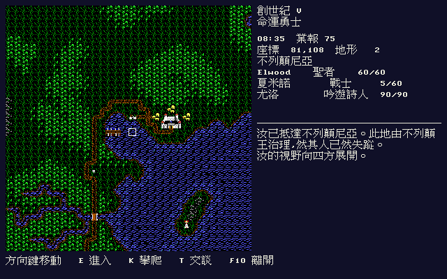 |
| **地牢** —— 第一人稱透視走廊,梯子與寶箱照原版擺在走廊裡。沒點火把時整片全黑,那也是原版行為 | **全景(In Quas Wis)** —— 咒語把周圍 32×32 格一次攤開 |
| 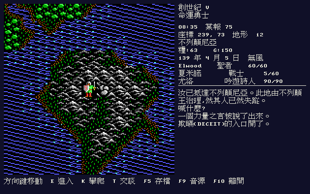 | 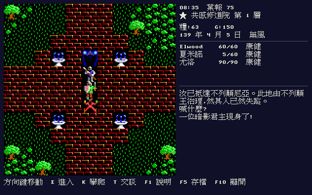 |
| **力量之言** —— 在地牢入口旁喊出 `FALLAX`,洞口封了起來。八個字各對一座地牢與一座聖壇 | **暗影君主** —— 在三團聖火所在的城裡喊出名字,牠就現身在汝面前兩格 |
| 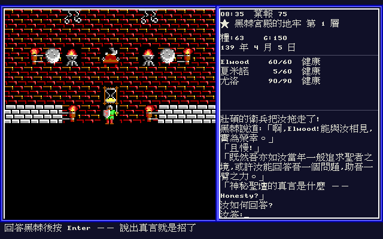 | 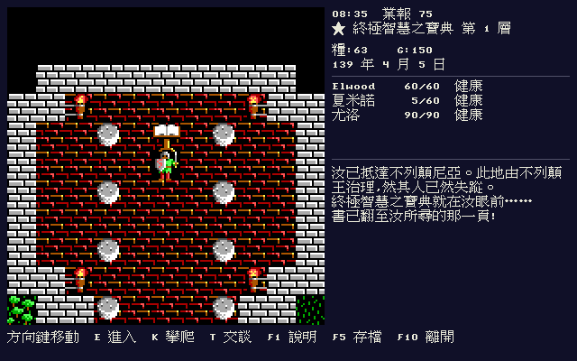 |
| **黑棘的審問** —— 說出真言,聖壇被玷污、業報 −5;一路不招,鍘刀落下。招與不招都會死人 | **終極智慧之寶典** —— 聖壇派汝來讀的那一頁。四間 11×11 石室出自 `MISCMAPS.DAT` |
| 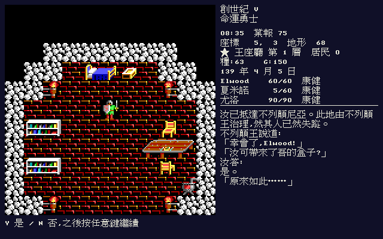 | 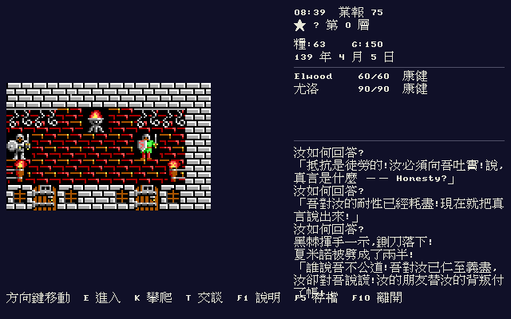 |
| **王座廳** —— 結局那一幕。「汝可帶來了吾的盒子?」——沒帶就沒有真結局 | **審問過後** —— 隊伍少了一個人,被丟進宮殿地牢,鑰匙也沒了 |
| 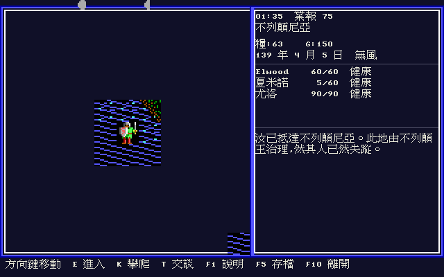 | 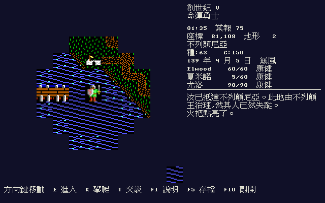 |
| **凌晨一點的曠野** —— 天一黑就只看得到身邊那一小圈。牆與山原本就擋視線,夜裡連空地都看不遠 | **同一個地方,點起火把** —— 平方半徑從 2 抬到 10,那一圈跟著撐開。城裡的火盆也照亮四周,但照不進隔壁房間 |
| 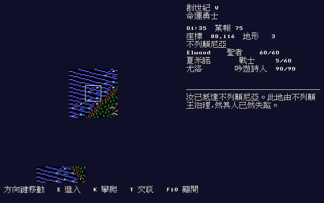 | 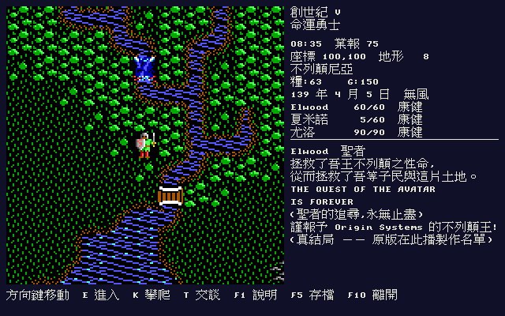 |
| **燈塔的光束** —— 天一黑,四座燈塔的光束就開始轉:三個扇區寬、一圈十六格。掃到哪裡,哪裡才看得見 | **真結局的頒獎狀** —— 中間那兩行原版是用符文字型畫的,維持英文;起算日 139 年 4 月 5 日與 `INIT.GAM` 對得上 |
| 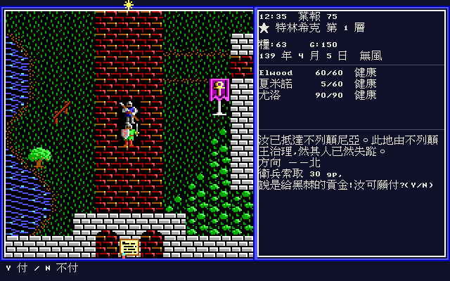 | 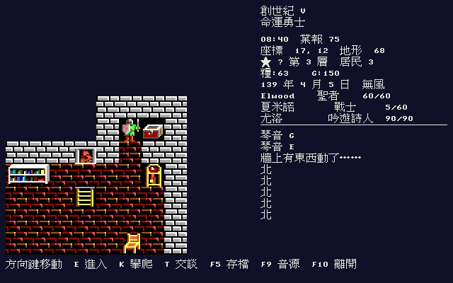 |
| **衛兵索取貢金** —— 全遊戲只有十三個攔路衛兵(對話號碼 0xFF),分布在五座城與黑棘的宮殿。付不出來就當場逮捕 | **豎琴後面的密室** —— 在王的城堡二樓坐下彈完十三個音,石牆開了。裡面躺著檀香木盒,真結局的前提 |
| 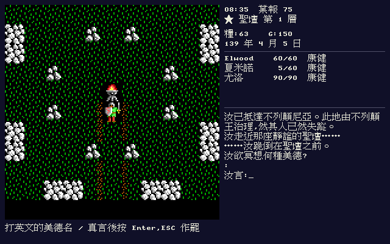 | 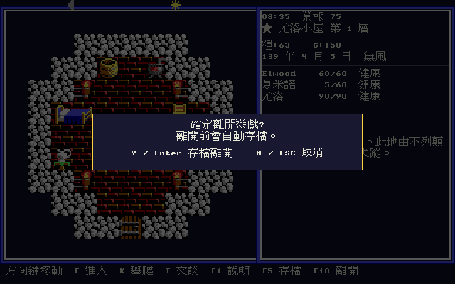 |
| **聖壇的石室** —— 四間 11×11 的房間出自 `MISCMAPS.DAT`,踏上正確的位置才讀得到寶典那一頁 | **離開確認框** —— `F10` 才會問這一句,`ESC` 永遠是取消。答 Y 之前先存檔,所以按錯鍵不會丟進度 |
| 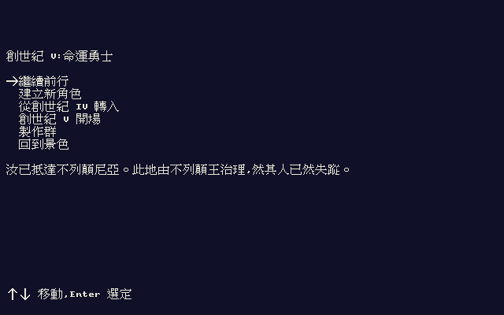 | 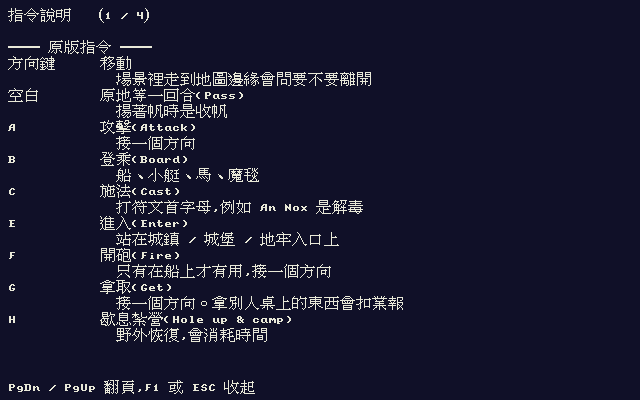 |
| **主選單** —— 開機第一個畫面,原版的六個項目。第二項「建立新角色」是吉普賽人的七題八德淘汰賽 | **`F1` 指令說明** —— 原版把 A–Z 二十六個字母全用光了,1988 年靠的是紙本手冊。現在手邊沒那本書,所以「開門是哪個鍵」得在遊戲裡答得出來 |
|  |  |
| **隊伍狀態** —— 原版右欄是 `Elwood 60G`(HP 加一個狀態字母);這裡把字母展開成「康健 / 中毒 / 沉睡 / 身亡 / 被惑」,那是玩家要據此行動的資訊 | **離開確認框** —— `F10` 才會問這一句,`ESC` 永遠是取消 |

重跑:`tools/shots.sh`(headless,不需要顯示環境 —— 截圖與實機共用同一條 CPU 繪製路徑)。

## 這是什麼

1988 年,Richard Garriott 讓玩家在《Ultima IV》成為聖者(Avatar)之後,把不列顛尼亞交到一個
暴君手上 —— 不列顛王失蹤,取而代之的是以「美德法典」之名行壓迫的統治,以及三名影主。
於是《Ultima V》問的不再是「你願不願意成為有德之人」,而是**當美德變成統治工具時,你怎麼辦**。

本專案不是修補原版執行檔,也不是接手某個開源引擎(U5 沒有可用的)——是**用 Go 從零重寫遊戲引擎**,
行為以 IDA Pro 反組譯原版當真值來源,**所有素材用原版**(美術、音樂、音效、地圖、數值一律不自製),
中文採 1990 年代 DOS 中文系統的**倚天原生點陣字**,而不是把現代 TTF 縮小。

## 技術路線

| 項目 | 選擇 |
|---|---|
| 語言 / 引擎 | Go 1.24 + Ebitengine v2 |
| 邏輯畫布 | 640×400(原版 320×200 的乾淨 2×),底圖 nearest 整數放大 |
| 中文字形 | **倚天中文系統(ETEN 3.53)原生點陣字**,16×15 / 24×24 |
| 行為真值 | IDA Pro 9.4;FM Towns 版是 32-bit Phar Lap `P3`,**Hex-Rays 反編譯可用** |
| 繪圖 | 全部畫在 `image.NRGBA` 上,Ebiten 只負責上傳紋理與收鍵盤 —— 所以截圖不需要 GPU |
| 建置 | 全程 Docker |

原版素材只要 **DOS 版**就夠了:`TILES.16` 與其餘 50 個圖檔的 LZW 壓縮都已破解
([`docs/formats/03`](docs/formats/03-picture-files.md))。FM Towns 與 PC-98 兩版降為對照組 ——
前者提供未壓縮 tileset(拿來逐位元組驗證解壓器)、英日雙執行檔、英日對照對話與 CD 音軌。
細節見 [`CLAUDE.md §2`](CLAUDE.md)(每一條都經一手開檔驗證)與 [`docs/re/`](docs/re/)。

## 操作:原版的鍵原樣保留,便利功能一律放 F 鍵

`A`–`Z` 二十六個字母在 U5 裡**每一個都是指令**(`A`ttack、`B`oard、`C`ast、`E`nter、
`G`et、`J`immy、`K`limb、`Y`ell、`Z`tats…),借一個字母就等於蓋掉一個原版指令。
所以本重製版加的東西全部掛在功能鍵上:

| 鍵 | 作用 |
|---|---|
| 方向鍵 | 移動(原版就是方向鍵) |
| **`F1`** | **指令說明** —— 原版 A–Z 每個字母都是指令,這裡逐條列出中文說明 |
| **`F5`** | **即時存檔** —— 原地存,不離開遊戲 |
| **`F6`** | **讀回存檔** |
| `F9` | 切換音樂來源(FM Towns FM ⇄ Roland MT-32) |
| **`F10`** / `Ctrl+Q` | 離開 —— 跳置中確認框,**離開前自動存檔** |
| **`ESC`** | **永遠是「取消」** |

`ESC` 那一條是硬規則,不是偏好:它退出對話、收起 Ztats、取消「等方向」、
關掉確認框,**任何一條路徑都不會結束遊戲**。原版的 `Q)uit & Save` 是存了就直接
回 DOS,而現代玩家按 ESC 的肌肉記憶是「我按錯了,回去」—— 讓那個手勢丟掉一小時
進度是設計失誤。姊妹專案 u1-cht 已經照這條做,四個 remake 的配置一致
(`F5` 存檔 / `F9` 音訊 / `F10` 離開)。

視窗右上角的叉叉走**同一個**確認框,不是另一條捷徑 —— 否則「F10 會存檔、
關窗不會」,而玩家不會知道這個差別。存檔寫進 `os.UserConfigDir()`,
不寫遊戲目錄(唯讀安裝也存得進去)。

## 譯名政策

繁體譯名的權威順序:

1. 1990 年代《軟體世界》雜誌「說明書補完計劃」的《創世紀第 V 代》中文說明書
2. **姊妹專案 [u6-cht](https://github.com/wicanr2/u6-cht) / [u4-cht](https://github.com/wicanr2/u4-cht) 的既有譯名 —— 系列共通名一律對齊,不另立新譯**
3. 現代直觀

第 2 條是硬規則。本專案第一版自己譯了五個地名,後來全部改回 u6-cht 的版本
(紫杉城 → **尤伊**、月光城 → **月華城**、哲倫 → **傑隆**、史卡拉布雷 → **斯卡拉布雷**、
黑刺 → **黑棘**)。整張表在 [`internal/i18n/names.go`](internal/i18n/names.go),
每一條與 u6 有關的都標了出處;`names_test.go` 會逐條核對,漂掉就紅。

⚠ **會拿去跟玩家輸入比對的字串,原文一律維持英文** —— 咒語名(要打得出「An Nox」)、
`Yes/No`、對話關鍵字(`name` / `job` / `join`)。中文只換顯示。這是 u4-cht 踩過的坑。

> 手冊掃描與轉錄僅供研究與譯名對照之用,著作權屬《軟體世界》雜誌與原譯者;
> 非商業使用,權利人要求即撤除。

## 還沒到的地方

誠實列出來,免得畫面看起來比實際完整:

- **文字沒翻完的只剩美術內嵌的字母**,以及選單 / 商店 / 地牢介面那幾處還沒
  自動巡查過的角落。`.TLK` 的 1,712 / 1,713 段走 `internal/i18n/talk.go`
  (key = `檔名#對話id#欄位`)覆蓋,重算用 `u5dump talkwork` + `tools/audittalk.py`
  (工作單附**英日對照**,日文靠索引表的 id 欄對齊,只當語意佐證不當譯名來源)。
  ⚠ 對白裡的**咒語符文與 `Yes/No` 之類要打字的東西維持英文**,那是刻意的
  (見上方譯名政策),自動巡查器對全大寫的串設了豁免才不會誤判成「漏翻」。
- **Get 指令接好了 —— 碎片與檀香木盒總算撿得起來**。這是三塊寶石碎片、
  檀香木盒、王冠 / 權杖 / 寶珠、月石、魔毯的唯一入口,而引擎先前完全沒有
  這個指令,所以真結局那條路是走不到的。順帶結掉「地牢寶箱的等級從哪來」
  那樁懸案(答案:沒有那個東西,地牢與地表是兩套程式碼),
  以及原版對「偷竊」的定義(拿別人桌上的飯扣 1 業報,拿牆上的火把不扣,
  它還特地說「借用!」)。見 [`docs/re/33`](docs/re/33-get-command.md)。
  **三塊碎片與寶珠擺在哪裡**也找出來了:它們不在任何資料檔裡
  (`.OOL`、`DUNGEON.CBT` 都掃過),是進地下世界時由程式當場塞進物件槽的,
  座標寫在執行檔的一張表裡。而且**用掉的碎片不會重生** —— 那個條件
  少一個,玩家就能撿第二次去消滅一位已經不存在的暗影君主。
  **檀香木盒也找到了**:它是 `CASTLE.NPC` 地點 17 的第 31 槽(生物編號 0x0E),
  躺在王的城堡二樓那間被牆封死的兩格密室裡 —— 豎琴彈完十三個音才開得了門。
  城裡的寶箱與地上的東西全都是 NPC 槽,靠 `sub_1E74` 鏡射進物件表 Get 才看得見
  ([`docs/re/36`](docs/re/36-sandalwood-box-npc-objects.md))。
- **結局的觸發條件解出來了 —— 而它在原版是死碼。** 條件是「活著的單位站在
  戰場第 2 列、**正北**那一格的疊圖是城堡外牆或城門(0x3C..0x3F)」。
  疊圖層(`byte_3F844`)只收石室地圖與物件 / NPC 的 tile 位元組,**地形進不去**,
  而城堡地形只存在於世界地圖 —— 所以原版自己就走不到這一幕。
  規則照抄保留,不自己補路。過程中更正了自己前兩版的兩處誤讀,
  合成一條紀律寫在 [`docs/re/34`](docs/re/34-ending-trigger.md) §7:
  **要斷言一塊記憶體是什麼,先把寫它的人列完。**
- **惹毛衛兵接好了 —— 而且問題本來就問錯了。** 原版沒有「偷竊偵測器」:
  會攔人的是**對話號碼 0xFF** 的那些 NPC。走過去搭話,他就開口要東西 ——
  一般城鎮是每個活著的隊員 10 gp「給黑棘的貢金」,米諾克要一半家財,
  黑棘的宮殿要戴著徽章再答出密語。給不出來就當場逮捕
  (⚠ 願意但沒錢也一樣抓)。細節見 [`docs/re/32`](docs/re/32-guard-challenge.md)。
  `sub_195C` 的第三個入口後來也追出來了 —— 就是「盤查失敗 → 逮捕」的回程,
  不是另一條路([`docs/re/35`](docs/re/35-harp-and-the-secret-door.md) §5)。
- **石室的走位接上了**。`sub_134CC` 是「朝目標走一格」的原語,原版用
  `while` 把它走完;這裡算成一條路徑,呼叫端逐格推進(規則不依賴幀數,
  所以 headless 與測試不用逐格跑)。⚠ 平手時走**橫向**,抄反了結局那一幕的
  斜向走位會不一樣。
- **音樂接好了,音效還沒**(P6)。三套音源都離線轉成 ogg:FM Towns 的
  15 首 `.EUP`(EUPHONY 序列 + `.FMB` 4-op 音色自己合成)、CD 兩條音軌,
  以及 upgrade 包的 16 首 `.XMI`(→MID→Roland MT-32)。**F9 切換兩套音源**。
  ⚠ 「哪個場景播第幾首」不在 `.TBL` 裡 —— 那張表只給曲號 → 檔名與六聲道音量,
  場景對應寫在程式碼裡的 32 個呼叫點([`docs/re/87`](docs/re/87-bgm-selection-and-the-tbl-tables.md));
  MT-32 那批的曲號則是靠**旋律比對**對上的(音高差分的最長共同子串,
  [`docs/re/98`](docs/re/98-select-menu-and-song-melody-matching.md))。
  25 個 `.SND` 音效還沒接。
- **打包與 CI 好了**(P7):`tools/package.sh` 產 Linux `tar.gz` 與 Windows `zip`,
  GitHub Actions 每次 push 跑 gofmt / vet / test / 交叉編譯 / **交付包編碼檢查**,
  打 tag 時另外用 macOS runner 出 arm64 + x86_64 的 universal 二進位。
  ⚠ **GUI 實機啟動尚未在本機驗過**(開發環境沒有顯示裝置);
  已驗的是解壓後資料讀得起來、缺資料時會用一句中文說清楚並以 1 結束。
- **視線遮蔽與夜晚照明做好了**。牆與山擋得住後面的東西,站在房間裡看不到
  隔壁房間;天一黑視野縮成身邊九格,要靠火把、In Lor 或場景裡的火盆才看得遠;
  Wis An Ylem 真的能穿牆。日出日落有六段十分鐘一階的漸變。
  `sub_2E944` 追出來不是「光源閃爍」而是**燈塔的光束在轉**,也接上了。
  過程見 [`docs/re/31`](docs/re/31-line-of-sight.md) —— 其中 §6 記了一個
  值得一看的教訓:同一個緩衝區被兩支函式當成不同語意,只讀其中一支
  會推出「夜晚與白天一樣」這種完全錯誤的結論。
- **交談流程補齊了**。原版會**先問方向**(引擎原本自己掃四周);
  對面沒人時隔著櫃檯 / 桌子 / 窗口**再看一格**(少了這段,櫃檯後面的
  店主根本叫不到);地形 0x9D 是「無人回應」、0xAB 是「那個人睡著了」。
- **豎琴那首曲子接上了**。站在豎琴前(正南那一格)按數字鍵發音;
  在不列顛王城堡二樓把十三個音彈對,場景 (17,13) 那一格會被切換 ——
  一道暗門。彈錯不是從頭來,原版手寫了一組回退規則(等同 KMP 的
  failure function)。見 [`docs/re/35`](docs/re/35-harp-and-the-secret-door.md)。
- **In Sanct Grav 在戰鬥中**追到「傷害 0、沒有狀態」就沒有下文了;
  如果它其實會留下力場,那要在投射物飛行(`sub_1FE54`)裡,還沒讀。

逐項現況見 [`WORKLIST.md`](WORKLIST.md);每一條「未做」旁邊都寫了缺什麼證據。

## 開發

```bash
# 建置容器(Go + CGO/GL/X11 + Pillow + 7z)
docker build -t u5cht/dev docker/

# 編譯、靜態檢查、測試
tools/dev.sh build
tools/dev.sh vet
tools/dev.sh test     # 無原版素材也應全綠
tools/dev.sh itest    # 對 gamedata/ 實測(設 U5_GAMEDATA)

# 烘倚天中文點陣字(自備倚天字庫;產物不入庫)
tools/dev.sh font 15
```

**原版資料由玩家自備**,放進 `gamedata/`(不入庫)。整合測試設 `U5_GAMEDATA` 指向該目錄後才會執行,
沒設就跳過。

打交付包(Linux tar.gz + Windows zip,全程 docker):

```bash
tools/package.sh v0.1.0     # 產物在 dist/
```

⚠ 包裡**不含原版資料,也不含烘好的中文字庫** —— 前者是玩家自備的合法副本,
後者衍生自 1993 年的商業字型。給 Windows 的 zip 有三條硬規矩,而且只有在
繁體中文 Windows 上才看得出違反:**檔名一律 ASCII**(zip 沒有檔名編碼欄位,
非法的 CP950 序列會讓解壓工具直接跳過該檔,玩家看到的是「檔案不見了」)、
`.bat` 存 **CP950**、`.txt` 存 **UTF-8 with BOM**,換行都 CRLF。
`tools/checkpkg.py` 逐條驗,CI 每次跑。

其他工具:`tools/ida.sh`(headless 反組譯)、`tools/shots.sh`(重跑畫面)、
`u5dump pictures`(圖檔形狀表目視驗收)、`tools/fdi_extract.py`(PC-98 磁碟映像抽檔)、
`tools/cdimg_to_iso.py`(CD raw 映像 → ISO)。

## 文件索引

| 文件 | 內容 |
|---|---|
| [`CLAUDE.md`](CLAUDE.md) | 專案憲章:硬規則、素材盤點(已驗證事實)、IDA 使用紀律、中文化設計、階段與驗收 |
| [`WORKLIST.md`](WORKLIST.md) | **遊戲機制還原盤點**:原版有什麼、做到哪、缺什麼 |
| [`CONTEXT.md`](CONTEXT.md) | 語彙(glossary)、與姊妹專案的關係、技術關鍵事實 |
| [`docs/formats/`](docs/formats/) | 資料格式規格(每份附可重跑的解碼腳本與驗證 oracle) |
| [`docs/re/`](docs/re/) | 逆向筆記(每份標:輸入檔 + IDA 位址 + 被推翻過的斷言) |

## 授權與邊界

- **程式碼**:MIT。
- **原版遊戲資料、美術、音樂、字型**:各原權利人所有,**不隨本專案散布**;
  repo 只提供解碼工具與引擎,玩家自備合法副本。
- 上面的畫面截圖含有原版美術,僅為說明本專案的呈現效果;權利人要求即撤除。
- *Ultima V: Warriors of Destiny* © 1988 Origin Systems / Richard Garriott。
  本專案與 Origin / EA 無關聯。
